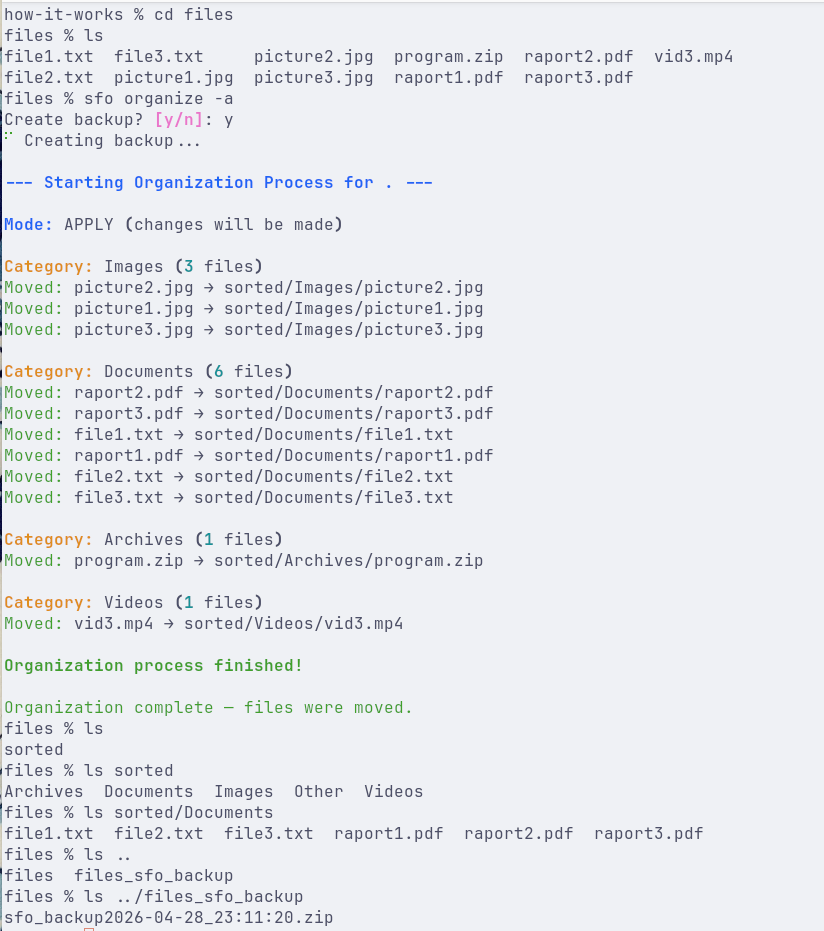

# 🧹SFO – Smart File Organizer 

A witty CLI buddy that tidies your messy folders into organized ones.  
Whether it’s `Downloads`, `Desktop`, or a custom directory, run `sfo` and let it clean up your files into categorized folders.



## 💡Motivation 

I didn’t have time to manually clean up my Downloads folder and I wasn’t sure which files were actually important.  
That’s why I built SFO – a simple CLI tool that automatically moves files into organized folders by category.

Now I can quickly jump between file types, finish reviewing one folder, and come back to it later.  
I also wanted all my files grouped by categories (images, documents, videos, etc.) so it’s easier to find what I need.

## ⚡Quick Start 

### Installing dependencies

#### If you have Python installed

```bash
# Install uv
    pip install uv
```

#### If you don’t have Python installed

- Install [uv](https://docs.astral.sh/uv/getting-started/installation/#standalone-installer).
- Use `uv` to manage your Python installation.

---

### Installing the tool

#### Clone the repository

```bash
    git clone https://github.com/kacper-korzen/sfo.git
    cd project-name
```

#### Recommended way

```bash
# Run in cloned repository
    uv tool install -e .
```

#### Removing the tool

```bash
    uv tool uninstall sfo
```

---

### 🚀 Running SFO

#### Organize files in the current directory

```bash
# Dry run (show what would be moved, no changes)
    sfo organize
```

```bash
# Apply changes
    sfo organize -a
```

---

## 📖 Usage

### Applying changes

To apply **organize** or **restore** changes, use the `-a` (`--apply`) flag.  
Without `-a`, the command runs as a dry‑run (shows what would be done, without changing files).

---

### 🛠️Making your own rules 

You can customize behavior by editing `config.py`:

- Add more file extensions to existing categories.
- Add new directories to watch.
- Change the backup file name.
- Change the name of the directory where folder structure is saved.

Edit `config.py` and re‑run the tool to see your custom rules in action.

---

### 🧪Examples 

Always run commands in the directory you want to modify.

#### Organize files

```bash
    sfo organize -a
```

#### Restore from backup

```bash
    sfo restore -a
```

#### Create a backup of folder structure

```bash
    sfo backup
```

---

## 🤝 Contributing

### 1. Clone the repository

```bash
    git clone https://github.com/kacper-korzen/sfo.git
    cd project-name
```

### 2. Set up virtual environment

```bash
    uv venv
    source .venv/bin/activate  # On Windows: .venv\Scripts\activate
    uv sync
```

### 3. Install the tool in development mode

```bash
    uv tool install -e .
```

Now you can run the tool using:

```bash
    sfo command --flag
```

---

## 📚 Resources

- [Typer docs](https://typer.tiangolo.com)
- [uv docs](https://docs.astral.sh/uv/)
